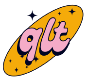

# The CodeQL Development Toolkit (QLT)

The CodeQL Development toolkit is a tool for making common CodeQL development workflows easier. Some of its key features include:

- Creation and management of new CodeQL queries and query packs.
- Creation and management of new CodeQL unit tests and unit test packs. 
- Integration with common automation systems such as GitHub Actions which adds support for:
    - Automated query testing 
    - The ability to test your queries on sets of example databases
    - The ability to do performance testing
    - The ability to do regression testing (false positives / false negatives)

Below is a guide showing you how to perform the most common tasks with the CodeQL Development Toolkit

# Installation

You can install QLT by grabbing a release on the releases page. We currently ship builds for Linux x86_64 and MacOS. There are no dependencies to install. Just unpack the bundle and run the binary `qlt` in the unpacked directory. 

# General Command Structure 

QLT is organized groups of functionality called "Features." Within those features, the functionality of that feature is split into 4 verbs that describe the functionality provided:

Which In the following sections you will find documentation of those features as well as examples of their most common usages. 

# Query Feature 

# Architecture 

